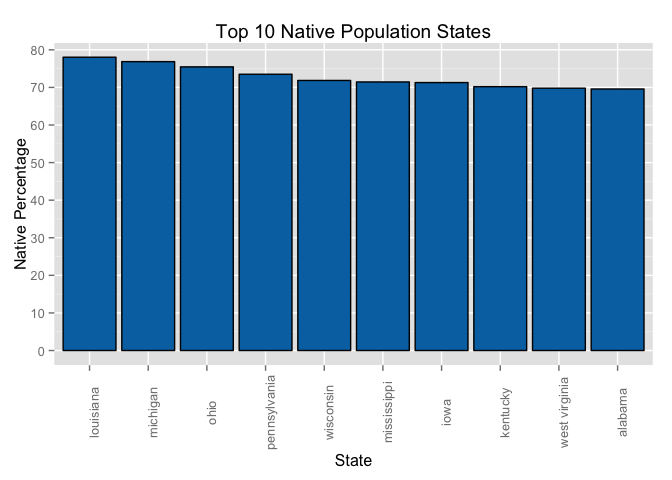
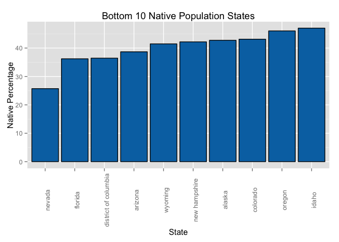
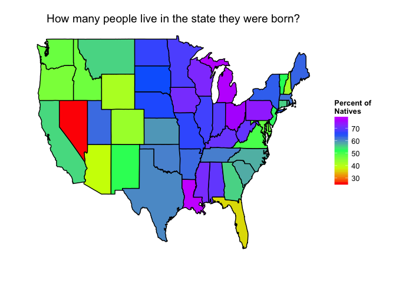

# Percentage of natives across the US
Matthew Bender

July 29th, 2015

[GitHub](https://github.com/codebender)

[Twitter](https://twitter.com/5280code)

## Synopsis

In my [previous script](https://www.kaggle.com/codebender/2013-american-community-survey/colorado-transplants),
I determined how many Coloradans are "natives", meaning born in Colorado. 43& of Coloradans are natives.
My follow up question to that was, how does that compare to all other states? So that is the goal of this
script.  I plan to identify the top and bottom "nativeness" states and see how Colorado compares.


### Basic Setup

#### Dependencies

```r
library(readr)
library(plyr)
library(dplyr)
```

```
## 
## Attaching package: 'dplyr'
## 
## The following objects are masked from 'package:plyr':
## 
##     arrange, count, desc, failwith, id, mutate, rename, summarise,
##     summarize
## 
## The following objects are masked from 'package:stats':
## 
##     filter, lag
## 
## The following objects are masked from 'package:base':
## 
##     intersect, setdiff, setequal, union
```

```r
library(tidyr)
library(ggplot2)
library(maps)
```

```
## 
## Attaching package: 'maps'
## 
## The following object is masked from 'package:plyr':
## 
##     ozone
```

```r
options(scipen = 9)
```

#### Load Data

```r
censusData <- read_csv('../input/pums/ss13pusa.csv')
```

```
## 
|================================================================================| 100% 1450 MB
```

```
## Warning: 110068 problems parsing '../input/pums/ss13pusa.csv'. See
## problems(...) for more details.
```

```r
censusDataB <- read_csv('../input/pums/ss13pusb.csv')
```

```
## 
|================================================================================| 100% 1364 MB
```

```
## Warning: 118958 problems parsing '../input/pums/ss13pusb.csv'. See
## problems(...) for more details.
```

```r
censusData <- rbind(censusData, censusDataB)
censusDataB <- NULL
dim(censusData)
```

```
## [1] 3132795     283
```

## Data Analysis

### Group by State & Birth Place

```r
ECHO=TRUE
birthPlaces <- select(censusData, ST, POBP, PWGTP) %>%
  group_by(ST, POBP) %>%
  summarize(Total=sum(PWGTP)) %>%
  arrange(desc(Total))
```

### Calculate & Merge State Populations

```r
totalPopulations <- group_by(birthPlaces, ST) %>%
  summarize(totalPopulation=sum(Total))

birthPlaces <- join(birthPlaces, totalPopulations, by = "ST")
```

### Filter to only Natives of each state

```r
natives <- filter(birthPlaces, ST == POBP)
```

### Decode State codes

```r
stateCodeCSV = "POBP,region
001,Alabama
002,Alaska
004,Arizona
005,Arkansas
006,California
008,Colorado
009,Connecticut
010,Delaware
011,District of Columbia
012,Florida
013,Georgia
015,Hawaii
016,Idaho
017,Illinois
018,Indiana
019,Iowa
020,Kansas
021,Kentucky
022,Louisiana
023,Maine
024,Maryland
025,Massachusetts
026,Michigan
027,Minnesota
028,Mississippi
029,Missouri
030,Montana
031,Nebraska
032,Nevada
033,New Hampshire
034,New Jersey
035,New Mexico
036,New York
037,North Carolina
038,North Dakota
039,Ohio
040,Oklahoma
041,Oregon
042,Pennsylvania
044,Rhode Island
045,South Carolina
046,South Dakota
047,Tennessee
048,Texas
049,Utah
050,Vermont
051,Virginia
053,Washington
054,West Virginia
055,Wisconsin
056,Wyoming"

stateCodes <- read_csv(stateCodeCSV)

natives <- join(natives, stateCodes, by = "POBP") %>%
  select(region, population=totalPopulation, natives=Total)

natives$region <- tolower(natives$region)
```

### Calculate "Nativeness"

```r
natives$nativeness <- natives$natives / natives$population * 100

natives <- arrange(natives, desc(nativeness))
```


## Results

### States with Highest percentage of natives

```r
head(natives, n=10)
```

```
##           region population natives nativeness
## 1      louisiana    4625470 3609533   78.03603
## 2       michigan    9895622 7605852   76.86078
## 3           ohio   11570808 8731681   75.46302
## 4   pennsylvania   12773801 9389081   73.50264
## 5      wisconsin    5742713 4126251   71.85195
## 6    mississippi    2991207 2137327   71.45366
## 7           iowa    3090416 2203143   71.28953
## 8       kentucky    4395295 3085415   70.19813
## 9  west virginia    1854304 1294216   69.79524
## 10       alabama    4833722 3363089   69.57556
```

```r
stateOrder <- reorder(natives$region, -natives$nativeness)
ggplot(natives[1:10,], aes(stateOrder[1:10], nativeness)) +
  geom_bar(stat="identity", fill='#0072B2', color='black') +
  scale_y_continuous(breaks = seq(0, 80, by = 10)) +
  theme(axis.text.x=element_text(angle=90))+
  labs(title = "Top 10 Native Population States",
       x = "State", y = "Native Percentage")
```

 

### States with the Lowest percentage of natives

```r
natives <- arrange(natives, nativeness)
head(natives, n=10)
```

```
##                  region population natives nativeness
## 1                nevada    2790136  717621   25.71993
## 2               florida   19552860 7084102   36.23052
## 3  district of columbia     646449  235639   36.45129
## 4               arizona    6626624 2563992   38.69228
## 5               wyoming     582658  241675   41.47802
## 6         new hampshire    1323459  558310   42.18567
## 7                alaska     735132  314216   42.74280
## 8              colorado    5268367 2272215   43.12940
## 9                oregon    3930065 1809504   46.04260
## 10                idaho    1612136  758083   47.02351
```

```r
stateOrder <- reorder(natives$region, natives$nativeness)
ggplot(natives[1:10,], aes(stateOrder[1:10], nativeness)) +
  geom_bar(stat="identity", fill='#0072B2', color='black') +
  scale_y_continuous(breaks = seq(0, 50, by = 10)) +
  theme(axis.text.x=element_text(angle=90))+
  labs(title = "Bottom 10 Native Population States",
       x = "State", y = "Native Percentage")
```

 

### Nativeness Map

```r
us_state_map = map_data('state')
us_state_map <- join(us_state_map, natives, by = 'region')

ggplot(us_state_map, aes(long, lat, group=group)) +
  geom_polygon(aes(fill = nativeness), colour="black") +
  scale_fill_gradientn(colours=rainbow(5)) +
  theme_light() +
  theme(strip.background = element_blank(),
        strip.text.x     = element_blank(),
        axis.text.x      = element_blank(),
        axis.text.y      = element_blank(),
        axis.ticks       = element_blank(),
        axis.line        = element_blank(),
        panel.border     = element_blank(),
        panel.grid       = element_blank(),
        legend.position  = "right") +
  xlab("") + ylab("") +
  labs(title = "How many people live in the state they were born?",
       fill = 'Percent of \nNatives')
```

 


## Conclusions

As I expected, Colorado is in the group of states with the lowest percentages of natives, 8th lowest.  It was really
surprising to see how low Nevada's native percentage is, 25.7%.  There were 8 states with a native 
percentage above 70%, Louisiana leading every state with 78%.
